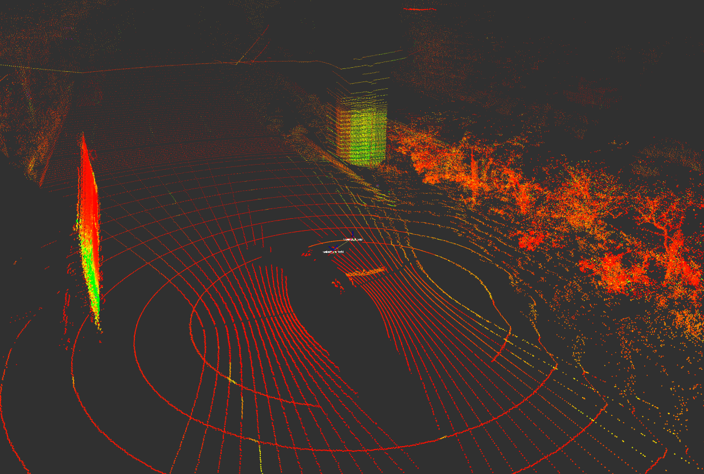
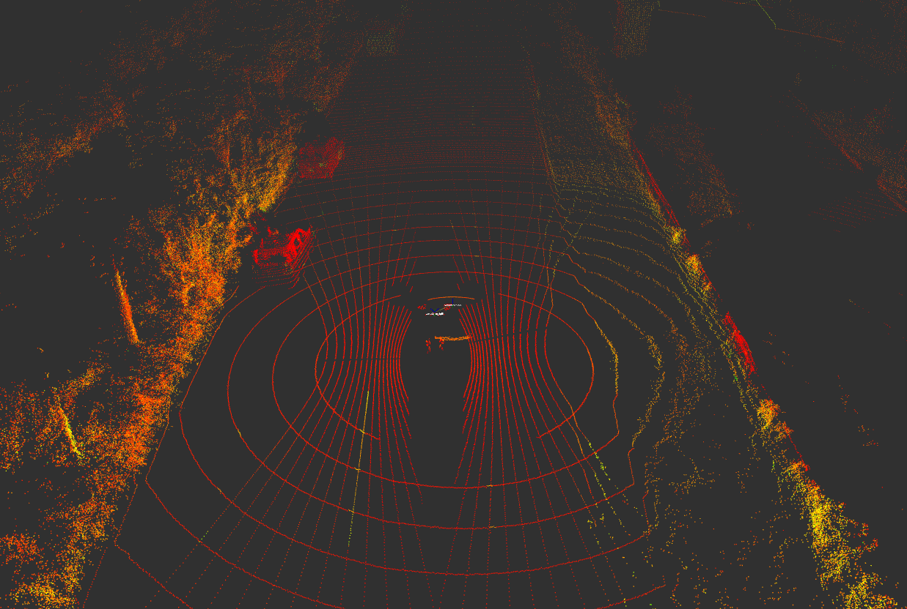

# pc2_combiner
---
This is a ROS 2 package to transform and combine multiple PointCloud2 messages into a single one. Points are transformed and combined with all their fileds, not just x, y and z. Therefore the produced point cloud contains intensity and ring fileds, so we get a colorful cloud on RViz. The launch file `combine.py` publishes a transform for each PointCloud2 topic.

Here is the tf tree on RViz:


### How to use the package

First clone and build the package. Then run the launch file, it will publish transforms and start the node.

```bash
mkdir -p my_ws/src
cd my_ws/src
git clone https://github.com/mebasoglu/pc2_combiner.git
cd ..
colcon build
```

```bash
source install/local_setup.bash
ros2 launch pc2_combiner combine.py
```
    
The package has the `pc2_combiner` node which is the main and only node. First, it waits and tries to get necessary static transforms. After that, the node becomes initialized and waits for the PointCloud2 topics.

Topics are subscribed via message filters with approximate time policy so that we have a single callback with matched PointCloud2 messages by their timestamp.

In the callback, each point is transformed with corresponding `TransformStamped` message and appended to an empty point cloud.

The node works on a single thread and it is possible to increase the performance by implementing a multi-threaded structure to transform points.

### Subscribed topics

- /sensing/lidar/left/pointcloud_raw , PointCloud2
- /sensing/lidar/right/pointcloud_raw , PointCloud2
- /sensing/lidar/top/pointcloud_raw , PointCloud2

### Published topic

- /sensing/lidar/concatenated_point_cloud , PointCloud2

Here are some screenshots of the combined cloud:




